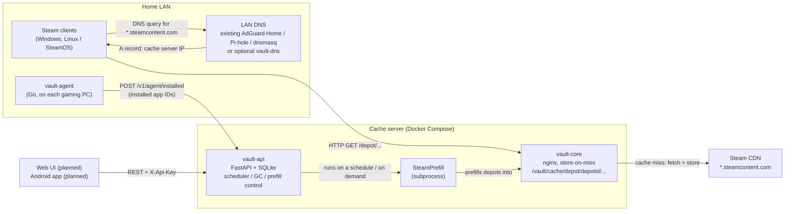

# SteamVault

A self-hosted, Docker-first Steam LAN download cache with **true per-game
management** — see which game occupies how much space, and delete individual
games from the cache. Built for homelab operators and LAN party organizers.

> SteamVault is a community project and is not affiliated with Valve
> Corporation. "Steam" is a trademark of Valve Corporation.

## Why not just use LanCache?

[LanCache](https://lancache.net/) is the de-facto standard for LAN caching of
game downloads across multiple services (Steam, Epic, Battle.net, ...), and
it works well for that. SteamVault is not a replacement or a "LanCache
killer" — it is a **Steam-only, narrower alternative** that trades LanCache's
multi-service breadth for one specific capability LanCache's design can't
offer: because it stores cached files under a generic hashed cache key,
LanCache has no clean way to delete a single game from the cache. Community
tools like `lancache-manager` work around this by parsing access logs after
the fact.

SteamVault inverts the approach. The Steam CDN already encodes the depot ID
in the URL (`/depot/<depotid>/chunk/<hash>`), so storing the cache
**path-faithfully** (nginx `proxy_store` instead of `proxy_cache`) makes the
game-to-file mapping part of the directory structure from day one. Deleting a
game means deleting its depot folders — no log parsing, no key
reconstruction, no heuristics.

If you want to cache Epic, Battle.net, or Riot downloads too, use LanCache.
If you only care about Steam and want per-game visibility and cleanup,
SteamVault is built for exactly that.

## Architecture



### Components

| Component | Role |
|---|---|
| **vault-core** | nginx with `proxy_store` — the cache itself. Path-faithful depot storage, no LRU/eviction (deletion is explicit, by design). |
| **vault-dns** | Optional bundled dnsmasq container for LANs with no existing DNS server. Not needed if you already run AdGuard Home, Pi-hole, dnsmasq, or Unbound. |
| **vault-api** | FastAPI + SQLite control plane: depot→app mapping, prefill orchestration (drives [SteamPrefill](https://github.com/tpill90/steam-lancache-prefill) as a subprocess), per-game size/deletion, scheduler, manifest-based garbage collection. |
| **vault-agent** | Small Go binary on each gaming PC/Steam Deck. Reports installed app IDs to vault-api — the reporting path is read-only, no control logic on the device. It also has an *opt-in* hosts-file mode that, only when explicitly invoked, writes a managed block into the local hosts file. |
| **Web UI / Android app** | REST API consumers talking to vault-api. **Both are planned (Phase 4): the design is approved but no code exists yet** — see [Status](#status) below. |

Full architecture details, the cache storage layout, and the API surface are
in [`docs/PROJECT_PLAN.md`](docs/PROJECT_PLAN.md) (§2–6). Design decisions
that shaped the components above are recorded as ADRs in
[`docs/adr/`](docs/adr/).

## Quickstart (5 minutes)

Prerequisites:

- Docker Engine with Compose v2 (`docker compose`, not `docker-compose`)
- A LAN DNS server you can add a rewrite to (AdGuard Home, Pi-hole, dnsmasq,
  Unbound — or use the bundled `vault-dns` container if you have none)
- Outbound internet access (the cache fetches from the Steam CDN on a miss)

```bash
git clone <this-repo-url> steamvault
cd steamvault/deploy
cp .env.example .env
$EDITOR .env                      # set VAULT_API_KEY — the one mandatory value
docker compose up -d --build
```

Check the stack came up (export the key you just set so the curls below can use it):

```bash
export VAULT_API_KEY=<the value you put in deploy/.env>

curl http://<server>/health                     # -> ok                (vault-core)
curl -I http://<server>/lancache-heartbeat       # -> X-LanCache-Processed-By: steamvault
curl http://<server>:8080/v1/health              # -> {"status":"ok"}  (vault-api)
curl -H "X-Api-Key: $VAULT_API_KEY" http://<server>:8080/v1/games
```

**Security note before you go further:** the defaults above publish
`vault-core` on `0.0.0.0:80` (intentional — every LAN Steam client must reach
it) and `vault-api` on `0.0.0.0:8080`. Never port-forward vault-core to the
internet, and never port-forward vault-api either — reach it from outside
the LAN only via Tailscale/Twingate or your own TLS reverse proxy with
forward-auth on top of the API key. See `docs/PROJECT_PLAN.md` §10 and
[`deploy/README.md`](deploy/README.md#security-posture) for the full
reasoning, and [`docs/security/threat-model.md`](docs/security/threat-model.md)
for the full trust-boundary writeup — what an untrusted device on your LAN
can already do, where credentials actually live, and what this project does
not defend against.

### Point Steam at the cache (pick one DNS mode)

1. **You already run a local DNS server** (recommended): add a rewrite for
   `*.steamcontent.com` → this host's IP, and make sure `AAAA` queries for
   the same zone return no address (otherwise IPv6-capable clients silently
   bypass the cache). Copy-paste instructions for AdGuard Home, Pi-hole, and
   plain dnsmasq/Unbound are in [`dns/README.md`](dns/README.md).
2. **No local DNS server yet**: enable the bundled dnsmasq container and
   point your router's DHCP-advertised DNS at it:
   ```bash
   # in deploy/.env:
   #   CACHE_IP=192.168.1.50        <- LAN IP of this host
   #   VAULT_DNS_BIND=192.168.1.50  <- publish :53 on that IP only, never 0.0.0.0
   docker compose --profile dns up -d
   ```
3. **Single gaming PC, no DNS server at all**: use vault-agent's opt-in
   hosts-file mode instead (Windows and Linux/SteamOS both work — this mode
   is not Windows-only) — see [`agent/README.md`](agent/README.md).

### One-time SteamPrefill login

vault-api drives [SteamPrefill](https://github.com/tpill90/steam-lancache-prefill)
to proactively fill the cache; it needs a Steam session, created once,
interactively, by you (vault-api never sees, stores, or logs your Steam
credentials — [ADR-0004](docs/adr/0004-steam-credentials-never-touch-steamvault.md)):

```bash
cd deploy
docker compose run --rm --no-deps -it vault-api \
    /opt/steamprefill/SteamPrefill select-apps
```

Until you do this, everything else already works (`/v1/games`, the cache
itself) — only prefill jobs are blocked, with an actionable error message.

### Verify it's actually caching

- Install or update any Steam game on a client behind your LAN DNS. The
  first download is a **MISS**: vault-core fetches from the real Steam CDN
  and stores the response path-faithfully under
  `/vault/cache/depot/<depotid>/...` as it streams to the client.
- Delete and reinstall the same game (or install it on a second machine on
  the LAN). This time every chunk already on disk is a **HIT** — served at
  local disk/LAN speed, no *chunk* request reaches the Steam CDN. (Manifest
  requests are small and always go upstream, by design — they carry
  per-request codes and don't dedupe by URL.)
- `curl -H "X-Api-Key: $VAULT_API_KEY" http://<server>:8080/v1/cache/summary`
  shows total cache usage, free disk space, unmapped depots, and the top 10
  consumers once something has been cached; `GET /v1/games` has the
  full per-game breakdown.

Full deployment reference — volumes, backup, log rotation, the port-80/
dedicated-IP story, security posture, and a 62-check verification script —
lives in [`deploy/README.md`](deploy/README.md).

## FAQ

**Does this work for guests, without installing anything?**
Yes — that's the point. Any Steam client on the LAN that resolves
`*.steamcontent.com` to this cache server (because of the DNS rewrite) is
served automatically: no account, no vault-agent install, no app, zero
per-device setup. Because vault-core stores on the first miss
([ADR-0001](docs/adr/0001-proxy-store-feasibility.md)), the very first
guest's download already fills the cache for everyone downloading the same
game afterward — nobody has to be "first" on purpose.

**What about clients that bypass the cache (IPv6, DNS-over-HTTPS)?**
DNS-based redirection only works if the client actually asks *your* DNS
server and only for the record types you've overridden. If your resolver
still forwards `AAAA` queries for `*.steamcontent.com` upstream, IPv6-capable
clients will silently connect straight to Valve over IPv6 — no error, no log
entry, the cache just never gets used for that client. `dns/README.md`
documents closing this for every common resolver. Per-client bypass
*detection* surfaced in the API/UI is a planned Phase 3 feature and not yet
shipped — today the mitigation is DNS configuration, not runtime detection.
A client that uses Steam's own LAN peer-to-peer transfers instead of the
cache is expected and not a bypass.

**Can I delete just one game from the cache?**
Yes — this is the core design goal. `DELETE /v1/cache/{appid}` removes that
app's depot folders. Depots shared between multiple tracked games are
detected and protected from deletion while any co-owning game still has
cached content (see `docs/PROJECT_PLAN.md` §4).

**What happens when a game updates — does the cache go stale?**
The primary check is a SteamPrefill run *without* `--force`
([ADR-0006](docs/adr/0006-staleness-via-nonforced-prefill.md)): SteamPrefill's
own up-to-date bookkeeping makes this a ~3-second, zero-download no-op for an
app that's already current, and a real (but minimal — only the changed
chunks) fetch when it isn't. There is currently no pre-emptive "stale" badge
between scheduler sweeps — that would require the optional, opt-in
third-party manifest oracle (`VAULT_MANIFEST_ORACLE`), which is designed
(ADR-0006 decision 4) but **not yet shipped**. Manifest-based garbage
collection (`POST /v1/cache/{appid}/gc`) reclaims chunks that a game update
orphaned, diffing cached chunks against the current manifest rather than
guessing by file age — it is **dry-run by default at every layer**;
deleting anything requires the explicit opt-in `{"execute": true}`
([ADR-0007](docs/adr/0007-manifest-diff-gc.md)).

**Is my Steam account safe?**
SteamVault's own components never see your Steam password. The one-time
SteamPrefill login happens interactively in your own terminal; a future Web
UI/app login uses Steam's own "Sign in with Steam" OpenID flow, so the
credential never passes through anything in this repository
([ADR-0004](docs/adr/0004-steam-credentials-never-touch-steamvault.md)).

## Status

Backend phases are largely complete; the frontends (Phase 4) are planned —
design approved, no code yet. See
[`docs/PROJECT_PLAN.md`](docs/PROJECT_PLAN.md) §7 for the authoritative,
continuously updated checklist.

| Phase | What it covers | Status |
|---|---|---|
| 0 — Feasibility PoC | Validate `proxy_store` against real Steam traffic | Done |
| 1 — vault-core + vault-api MVP | Cache core, API skeleton, prefill orchestration, size/deletion, Docker Compose | Done |
| 2 — vault-agent | Windows + Linux/SteamOS PC listener, hosts-file mode, task/service packaging | Done |
| 3 — Scheduler & update logic | Cron window, staleness detection, manifest-diff GC | Mostly done — miss-triggered prefill, job pause/cancel, per-client bypass stats, webhooks, the opt-in manifest oracle (WP 3.9), optional auto-GC after update prefills, and open-beta branch manifest protection are still open (non-exhaustive) |
| 4a — Web UI | Browser SPA served by vault-api | Planned — design approved, no code yet |
| 4b — Android app | Kotlin/Compose app with Tailscale/VPN/public-domain connectivity | Planned — design approved, no code yet |
| 5 — Community release | This README, license, CI, contribution docs, announcement | In progress |

## More documentation

- [`docs/PROJECT_PLAN.md`](docs/PROJECT_PLAN.md) — vision, requirements, full
  architecture, phase plan, deployment notes, and open risks
- [`docs/adr/`](docs/adr/) — architecture decision records (feasibility,
  Linux/SteamOS agent scope, depot mapping, credentials, agent language,
  staleness, GC, cache-event feed)
- [`core/README.md`](core/README.md) — vault-core (nginx cache) internals
- [`api/README.md`](api/README.md) — vault-api endpoints, schema, and
  configuration
- [`agent/README.md`](agent/README.md) — vault-agent build, install, and
  hosts-file mode
- [`dns/README.md`](dns/README.md) — vault-dns and DNS rewrite instructions
  for AdGuard Home / Pi-hole / dnsmasq / Unbound
- [`deploy/README.md`](deploy/README.md) — full deployment reference
- [`docs/security/threat-model.md`](docs/security/threat-model.md) — the
  trust boundary, the cache contents, where credentials actually live, the
  personal-data surface, outbound data flows, and what this project
  deliberately does not defend against, cited by file/line against shipped
  code
- [`SECURITY.md`](SECURITY.md) — how to report a vulnerability privately

## License

**Apache-2.0** — permissive, includes a patent grant, chosen deliberately
over AGPL to keep the barrier low for contributors and companies alike
(see `docs/PROJECT_PLAN.md` §7, Phase 5 and [`LICENSE`](LICENSE)).
Contributions are accepted under the same license — see
[`CONTRIBUTING.md`](CONTRIBUTING.md).
